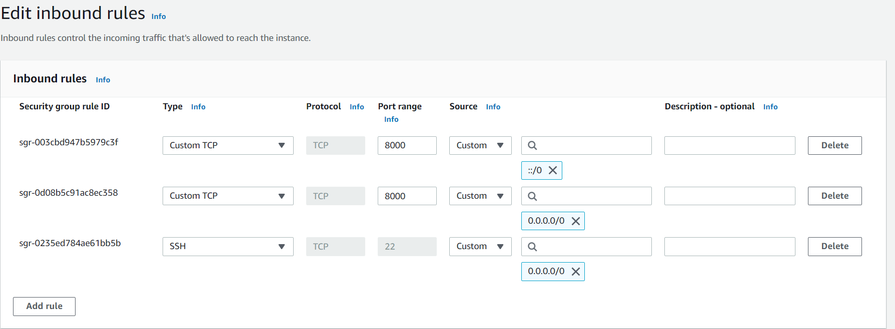

# ec2-django
## 기본 세팅
- login as: ubuntu
- pip 설치
    ```
    $ sudo apt-get update
    $ sudo apt-get install python3-pip
    $ pip3 install django
    $ python3 -m django --version
    ```
## Ubuntu 20.04에서 django web server를 배포하기
1. EC2 생성 - AMI를 Ubuntu 20.04로
2. EC2를 생성하는 데 사용한 Security Group에서 edit Inbount Rules를 통해 인바운드 규칙을 편집

Custom TCP타입을 추가한 후, 모든 IP에 대해 django web server의 기본 포트인 8000번을 허용한다.
3. mysite라는 이름의 간단한 django server를 run한다.
```
$ django-admin startproject mysite
```
4. 해당 패키지의 settings.py로 이동하여 ALLOWD_HOSTS에 'EC2의 public IP'(String 형태)를 추가해준다.

5. 다음 커맨드를 통해 웹 서버를 실행시킨다. 실행 커맨드 마지막에는 0.0.0.0:8000을 꼭 붙여준다.
```
$ python3 manage.py runserver 0.0.0.0:8000
```

